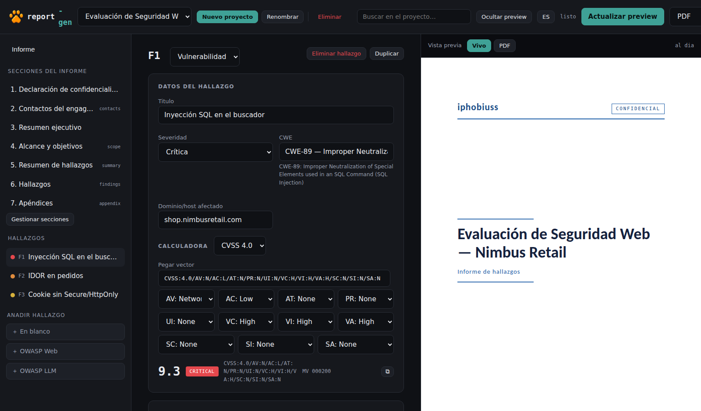
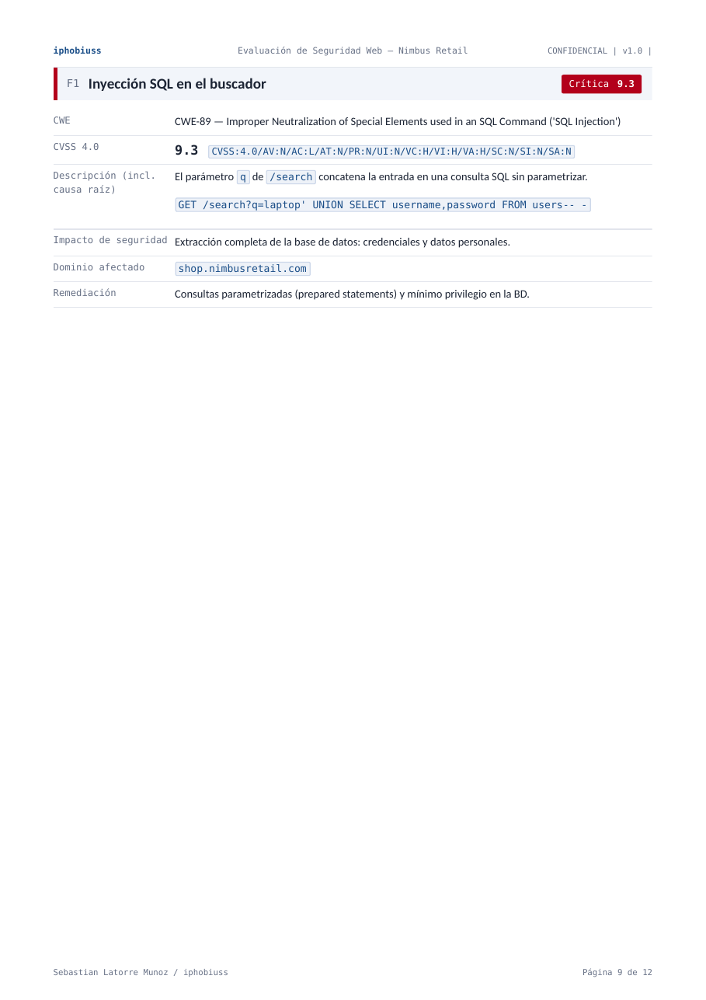

# report-gen

**Toolkit local-first para informes de pentesting.**

Engagements estructurados · PDF / DOCX / Markdown · CVSS 3.1 y 4.0 · Editor visual · Informes reproducibles

---

## Qué es

`report-gen` convierte un engagement de pentest en un informe profesional sin
depender de servicios externos. Cada trabajo es un `engagement.yaml`; el motor
produce el informe completo (portada, secciones, tabla de contenidos, resumen de
hallazgos con gráfico de severidades, hallazgos con CVSS y CWE, máquinas estilo
CTF/OSCP y apéndice de evidencias) en **PDF, DOCX y Markdown** desde una única
fuente. Todo corre en tu máquina, sin marcas de agua y con diseño propio.

## Características

- **Editor web local** con vista previa en vivo (HTML instantáneo) o PDF real,
  buscador global, arrastrar-para-reordenar y guardado automático.
- **Secciones encendibles** desde un catálogo canónico único; PDF, DOCX y MD
  reflejan siempre las mismas secciones activas.
- **Calculadora CVSS 3.1 y 4.0** por casillas **o pegando el vector completo**
  (detecta la versión y calcula al instante), con severidad y MacroVector en vivo.
- **Autodetección de CWE**: escribes el número o el nombre y lo resuelve.
- **Dos modos de hallazgo**: vulnerabilidad (CVSS, causa raíz, impacto,
  remediación, referencias) y máquina (host, fases, pasos con comando y figura,
  tabla de flags).
- **Exportación consistente** a PDF (WeasyPrint o Chromium), DOCX (`python-docx`
  puro, sin LibreOffice) y Markdown portable.
- **Interfaz bilingüe** ES/EN con un clic.

## Quick start

    # deps + entorno de desarrollo
    pip install -e ".[dev]"

    # motor de PDF: WeasyPrint (por defecto) o Chromium
    pip install playwright && playwright install chromium   # recomendado en Windows

    # app web
    python webapp/app.py            # abre http://127.0.0.1:8080

WeasyPrint es el motor de render por defecto. Si no está disponible (por ejemplo,
faltan sus librerías de sistema GTK en Windows), el motor cae automáticamente a
**Chromium (Playwright) para generar el PDF**, no solo para previsualizar; también
puedes forzarlo con `--backend chromium`.

## Corrección de CVSS

report-gen no solo "tiene una calculadora": el motor CVSS se valida contra los
vectores y recursos de referencia de **FIRST** y contra la implementación
**RedHatProductSecurity/cvss** (ejecutada sin modificar).

**CVSS 3.1**
- ✓ Vectores oficiales de FIRST
- ✓ Paridad Python ↔ JavaScript sobre 2.592 combinaciones de métricas Base

**CVSS 4.0**
- ✓ Parser canónico estricto
- ✓ MacroVector EQ1–EQ6 + interpolación de score
- ✓ 270/270 MacroVectors representados
- ✓ Paridad Python ↔ JavaScript en score y MacroVector
- ✓ 20.087 vectores contra `RedHatProductSecurity/cvss` v3.6, ejecutado sin modificar
- ✓ 0 divergencias de score

La historia completa (procedencia, sello y reproducción) está en
[`docs/CVSS40.md`](docs/CVSS40.md).

## Por qué está construido así

- **Engagement estructurado.** Un `engagement.yaml` es la única fuente de verdad;
  el informe es una proyección de esos datos, no un documento que se edita a mano.
- **Exporters desde una fuente común.** `engine.py` (HTML→PDF), `exporters/docx.py`
  y `exporters/markdown.py` recorren la misma estructura de secciones, así que los
  tres formatos coinciden en secciones y contenido (motores de render distintos).
- **Validación.** `validate.py` (sin dependencias) detecta severidades inválidas,
  IDs duplicados, vectores CVSS mal formados y desajustes severidad/score antes de
  renderizar.
- **CVSS con frontera de versiones.** El paquete `cvss/` separa 3.1 y 4.0 y
  despacha por versión; el motor 4.0 está congelado y sellado contra la referencia.

## Demo

Genera el informe de ejemplo en los tres formatos:

    python engine.py reports/canon/engagement.yaml -o out/informe.pdf
    python export.py reports/canon/engagement.yaml -f docx -o out/informe.docx
    python export.py reports/canon/engagement.yaml -f md   -o out/informe.md

## Arquitectura

    engine.py            YAML + Markdown -> Jinja2 -> WeasyPrint/Chromium -> PDF
    export.py            fachada de exportación
    exporters/           markdown.py, docx.py, pdf.py, common.py
    cvss/                v31, v40 (+ lookup/constants), dispatch por version
    validate.py          validacion de engagement sin dependencias
    sections.py          catalogo canonico de secciones
    designs/             report_sections.yaml (catalogo)
    templates/ themes/   Jinja2 + CSS (temas serio / corporativo)
    lang/                paquetes de idioma es / en
    wizard.py            asistente CLI para nuevos engagements
    webapp/              editor local (Flask): app.py, static/ (app.js, cvss40.js)
    tests/               suite pytest (+ runner stdlib) y corpus de referencia CVSS

## CLI / uso avanzado

    # asistente guiado
    python wizard.py

    # render directo con backend explícito y tema
    python engine.py reports/canon/engagement.yaml -o out/r.pdf --backend chromium

El formato del `engagement.yaml` (meta, secciones, hallazgos vuln/machine) está
documentado en los ejemplos de `reports/`.

## Tests

Suite con pytest en `tests/` (también corre sin pytest con `tests/run_stdlib.py`):

- CVSS 3.1 y 4.0 (ver [corrección de CVSS](#corrección-de-cvss)).
- Motor, catálogo de secciones y export PDF/DOCX/MD.
- Seguridad: path traversal, saneo de tema, subida de imágenes, bodies JSON
  inválidos, límite de slug.
- Validación de engagement.

CI en GitHub Actions corre Ruff + pytest (con Node para la paridad JS) en cada push.

## Threat model / limitaciones

Herramienta **local-first monousuario**: la app se sirve solo en `127.0.0.1` con
`debug=False`. No está pensada como servicio multiusuario expuesto. El Markdown de
la prosa se muestra como texto (los payloads HTML no se ejecutan en el informe) y
la vista previa se aísla en un iframe con `sandbox`.

## Inspiración

La interfaz de edición se inspira en el flujo de herramientas como SysReptor
(encender secciones y editarlas en el navegador), con un motor, un diseño y una
base de código propios.

## Licencia

MIT. Isotipo: Prometeo y Evaristo.
